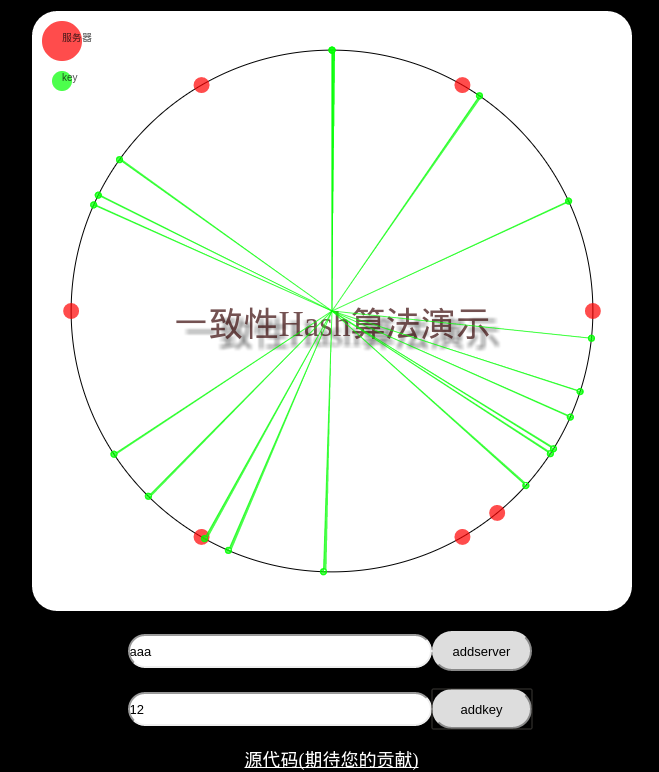

# php_hashTable
1. php hashTable的实现,  
2. hash码冲突的解决方法,  
3. 一致性hash的php实现

# 一致性hash算法演示(`服务端要求php环境`)
> 这只是一个简单版本,纯供个人演示与理解使用,建议

1. fork 该项目
2. clone 到本地
3. 将consistency_hash放到web环境下面,一定要可以使用IP|域名能访问到, 因为需要请求php端的hash算法
  1. 配置完成之后,需要在js/hash.js中的$.get()方法中修改下你本地服务器的地址,否则不能动态添加 `注意`  
4. 在浏览器中访问index.html页面可看到效果

# 接下来要做的
1. 添加localstorage
2. 添加条形hash桶的显示
